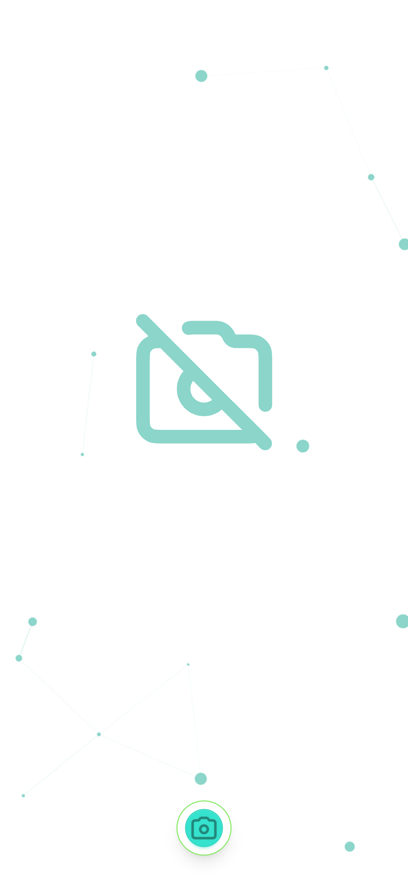

## ℹ️ Barcode Scanner with ZBar WASM

This project is a barcode scanner application built with React and ZBar WASM. It uses the device's camera to scan barcode and display the decoded information.

## 👨🏻‍💻 Live App

You can try the live version on GitHub pages here: https://sumitsahoo.github.io/barcode-scanner

## 📖 Features

1. PWA app can be installed on any device (on supported browsers)
2. Real-time barcode scanning
3. Start and stop scanning functionality
4. Switch between front and back camera in phones and tablets
5. Toggle flash for night time scanning
6. Display of scanning result in a dialog box with copy option
7. Haptic feedback (Android) on successful scan

## 🧐 Why this is not a library?

In many scenarios, the user interface (UI) requirements for scanner implementations vary significantly. This diversity in UI needs makes it impractical to encapsulate such functionality within a library, as it would severely limit the ability to customize the UI to meet specific requirements.

## 📷 Screenshots

### App running on iPhone



### App running on iPad


## 📦 Local Installation

Clone the repository:

```bash
git clone https://github.com/sumitsahoo/barcode-scanner.git
```

Install the dependencies:

```bash
npm install
```

## 📖 Usage

Start the application:

```bash
npm run dev
```

The application will open in your default web browser. Click the "Camera" button icon to begin scanning a barcode. The decoded information will be displayed in a dialog box.

## 🚢 Docker

If you are planning on deploying the app to the cloud, you need a Docker image. To build the same use the `Dockerfile` provided. The multi-stage build makes sure the resulting image is smaller in size and only includes the libraries that are needed. Also, the use of non-root user makes it more secure.<br>

Build device default architecture image (arm64 for Apple Silicon SoC & amd64 for Windows/Linux with Intel/AMD SoC):

```bash
docker build --no-cache -t barcode-scanner .
```

For amd64 (Intel & AMD) image (most common and widely supported by cloud):

```bash
docker build --no-cache --platform linux/amd64 -t barcode-scanner .
```

Once the image is built, you can push the same to any cloud provider and use a serverless service to deploy the same easily.

To run the Docker image locally use the below command:

```bash
docker run -it \
-p 8080:8080 \
--name barcode-scanner \
barcode-scanner
```

## 💼 Contributing

Pull requests are welcome. For major changes, please open an issue first to discuss what you would like to change.

## 🙏🏻 Attributions

1. <a href="https://github.com/undecaf/zbar-wasm" title="zbar wasm">ZBar WASM library for barcode detection</a><br>
2. <a href="https://www.svgrepo.com/" title="svg icons">Icons from SVG Repo</a>
3. <a href="https://pixabay.com/sound-effects/search/beep/" title="beep sound">Beep sound from Pixabay</a>


## 📜 License

MIT License

Copyright © 2024 Sumit Sahoo

Permission is hereby granted, free of charge, to any person obtaining a copy
of this software and associated documentation files (the "Software"), to deal
in the Software without restriction, including without limitation the rights
to use, copy, modify, merge, publish, distribute, sublicense, and/or sell
copies of the Software, and to permit persons to whom the Software is
furnished to do so, subject to the following conditions:

The above copyright notice and this permission notice shall be included in all
copies or substantial portions of the Software.

THE SOFTWARE IS PROVIDED "AS IS", WITHOUT WARRANTY OF ANY KIND, EXPRESS OR
IMPLIED, INCLUDING BUT NOT LIMITED TO THE WARRANTIES OF MERCHANTABILITY,
FITNESS FOR A PARTICULAR PURPOSE AND NONINFRINGEMENT. IN NO EVENT SHALL THE
AUTHORS OR COPYRIGHT HOLDERS BE LIABLE FOR ANY CLAIM, DAMAGES OR OTHER
LIABILITY, WHETHER IN AN ACTION OF CONTRACT, TORT OR OTHERWISE, ARISING FROM,
OUT OF OR IN CONNECTION WITH THE SOFTWARE OR THE USE OR OTHER DEALINGS IN THE
SOFTWARE.
